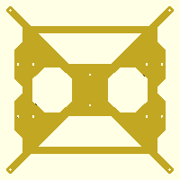

# Prusa3 y-frame (SCAD and DXF)

A replica of the original y-frame for the Prusa i3, but done entirely in OpenSCAD.

Can also be found at [Thingiverse](http://www.thingiverse.com/thing:1725423) or [Youmagine](https://www.youmagine.com/designs/prusa3-y-frame-scad-and-dxf).

License: [Creative Commons - Attribution - Non Commercial - Share Alike](https://creativecommons.org/licenses/by-nc-sa/4.0/)
